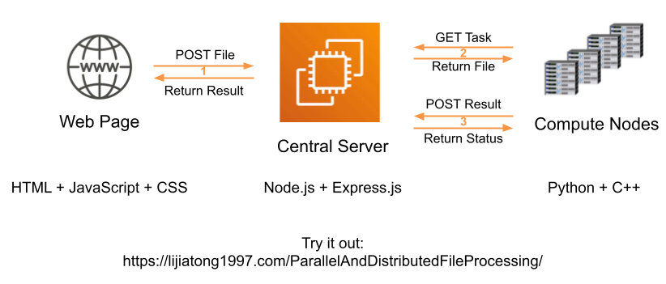
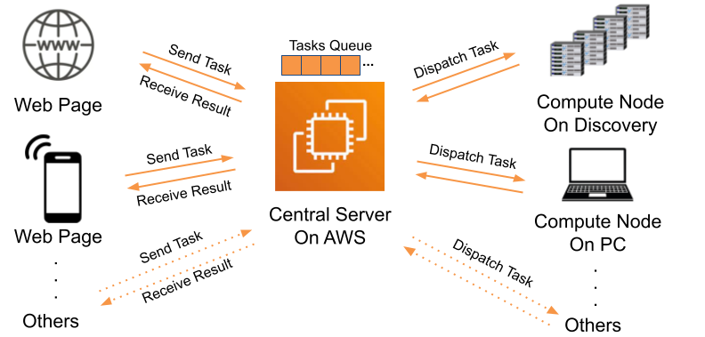

# ParallelAndDistributedFileProcessing

Jiatong Li designs a parallel and distributed file processing system in this project. Histogram equalization (Example: https://lijiatong1997.com/ParallelAndDistributedFileProcessing/) is used as an example task for this project. Actually, this system can be extended to other file processing tasks as well. 

## System Architecture

The whole system consists of three major components: front end page, central server that is running on AWS and compute nodes that are responsible for actual computation. Once a user visited the website and choose an image to upload, the front end page would send the file to the central server using HTTP post request. And the central server would either dispatch the task to a compute node immediately if there is an availability, or enqueue the task waiting for one compute node. The compute nodes would actively and regularly communicate with the central server once they are online, using Http get request. If there is a task pending processing, the compute node would get it and do the computation locally. The computation part is done by pre-compiled C++ program, either using OpenMP or CUDA to speed up for our project. 

On the node side, both GPU and CPU version of computing is implemented in this project. The Python script would call the pre-compiled C++ program to finish the actual computation. On the device enabled CUDA, operators can use GPU to leverage parallel computing benefit.

## Scalability and Stability

In this system, multiple compute nodes can connect to the central server concurrently. The system harvests the computing power from all the nodes. There is a task queue in the central server. If the queue gets too long, we can connect more compute nodes to the system at any time without rebooting the central server. On the other side, the system has automatic recovery ability, meaning even if a compute node crashed during the processing, the central server would automatically resend the task once the node is back online, so that the client query won’t loss. 

## Development Instruction

- Web Page: The real web page working with this system is `docs/indexReal.html`. However, I created a front-end only version, which is accessible anytime, to show what histogram equalization means. 

- Central Server: Node.js and Express.js are used. Add the username for the compute node that you are going to use to the `computeNodeMap` variable in the `server.js` script, before running it.

- Compute Node: Python, Requests and C++(and CUDA if using GPU) are used. Before running the script, follow the instruction in the folder to compile the C++ source file to get the executable files that is needed.